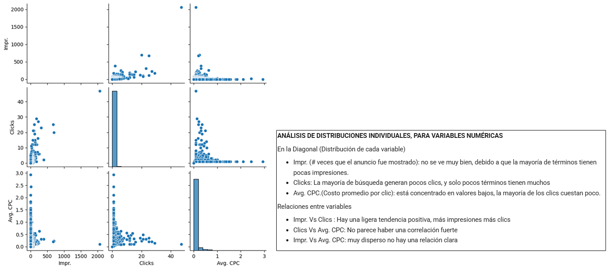
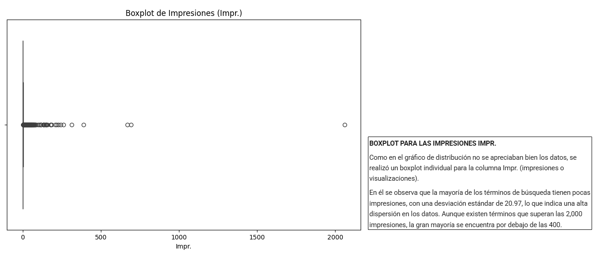
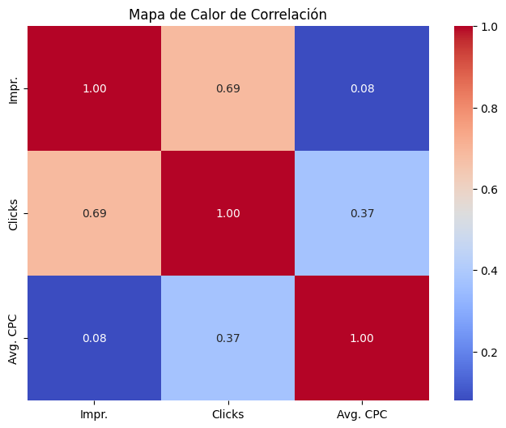
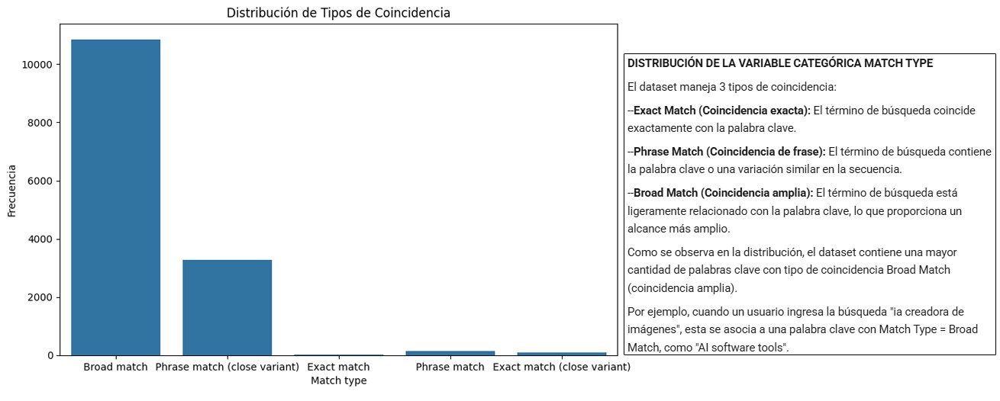
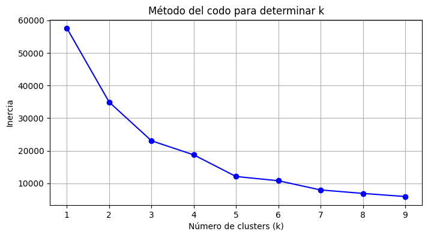
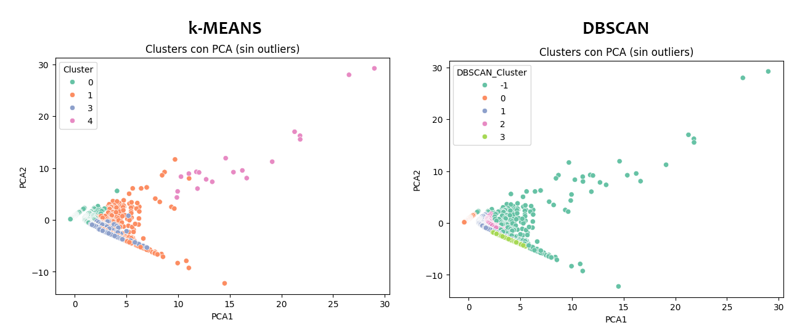
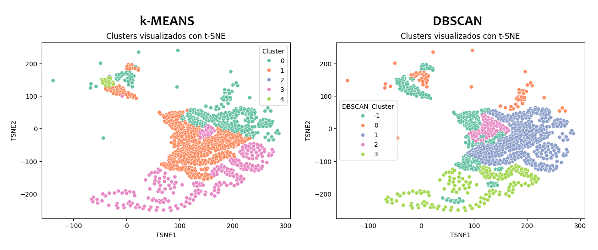

# Aprendizaje No Supervisado 
## 📑 Índice
1. [📂 Descripción y Estructura del Proyecto](#1---descripción-y-estructura-del-proyecto)
2. [💻 Entorno de Trabajo](#2---entorno-de-trabajo-y-librerías-utilizadas)
3. [🔍 Análisis Exploratorio de Datos (EDA)](#3---análisis-exploratorio-de-datos-eda)
4. [⚙️ Preprocesamiento](#4--️-preprocesamiento)
5. [🤖 Implementación de Modelos](#5---implementación-de-modelos)
   1. [🛠️ Implementación de K means](#51--️-implementación-de-k-means)
   2. [🛠️ Implementación de DBSCAN](#52--️-implementación-de-dbscan)
6. [📊 Visualización de resultados](#6---visualización-de-resultados)
   1. [📊 Reducción de Dimensionalidad con PCA](#61---reducción-de-dimensionalidad-con-pca)
   2. [📊 Reducción de Dimensionalidad con t-SNE](#62--️-reducción-de-dimensionalidad-con-t-sne)
   3. [📊 Tabla resumen por clúster](#63---tabla-resumen-por-clúster)
7. [💬 Reflexión y comunicación](#7---reflexión-y-comunicación)
8. [🧑‍💻 Autores](#6---autores)
## 1.- 📂 Descripción del proyecto
El equipo de Marketing está preparando una campaña publicitaria para productos relacionados con la inteligencia artificial y nos ha solicitado que les proporcionemos palabras clave que optimicen sus búsquedas en Google.

Para esto hemos utilizado el dataset: https://www.kaggle.com/datasets/devraai/ai-google-search-keyword-performance

Este dataset nos proporciona información sobre el rendimiento de palabras clave relacionadas con la inteligencia artificial en las búsquedas de Google. Este dataset es útil para analizar tendencias de búsqueda y evaluar la popularidad de términos específicos en el ámbito de la IA.

#### Objetivo General
Agrupar términos de búsqueda (Search terms) en clústers según su rendimiento publicitario, para ayudar al equipo de marketing a:
- Detectar segmenos de alto rendimiento
- Identificar términos costosos
- Optimizar la asignación de presupuesto

## 2.- 💻 Entorno de Trabajo y librerías utilizadas

Este proyecto fue desarrollado con Python en Google Colab

**Librerías utilizadas**

- **pandas**: para la carga, exploración y manipulación estructurada de los datos.
- **numpy**: soporte para operaciones matemáticas y manejo eficiente de arreglos numéricos.
- **matplotlib.pyplot** y **seaborn**: utilizadas para la visualización de datos mediante gráficos como histogramas, diagramas de dispersión y mapas de calor.
- **scikit-learn (sklearn)**: para el preprocesamiento de datos, reducción de dimensionalidad y aplicación de algoritmos de aprendizaje no supervisado:
  - `StandardScaler`: normaliza los datos para que todas las variables tengan igual importancia en los cálculos de distancia.
  - `KMeans` y `DBSCAN`: algoritmos de *clustering* utilizados para identificar patrones o grupos similares en el dataset.
  - `PCA (Principal Component Analysis)` y `t-SNE (t-distributed Stochastic Neighbor Embedding)`: técnicas de reducción de dimensionalidad empleadas para visualizar los datos y los resultados del clustering en dos dimensiones.

## 3.- 🔍 Análisis Exploratorio de Datos (EDA) 
El dataset contiene las siguientes variable o columnas

| Nombre de columna | Tipo de dato | Tipo de variable            | Descripción breve                                                           | Utilidad principal en el análisis                                        |
|-------------------|--------------|-----------------------------|-----------------------------------------------------------------------------|--------------------------------------------------------------------------|
| Search term       | Texto        | Categórica nominal          | Consulta real ingresada por el usuario en Google.                           | Detectar intención del usuario, descubrir nuevas palabras clave valiosas.|
| Match type        | Texto        | Categórica ordinal          | Tipo de coincidencia entre el search term y keyword (Exact, Phrase, Broad). | Evaluar el grado de control sobre la intención del usuario y refinar segmentación.|
| Impr.             | Numérico     | Cuantitativa discreta       | Número de veces que el anuncio fue mostrado.                                | Mide visibilidad, sirve para calcular CTR y evaluar alcance.             |
| Clicks            | Numérico     | Cuantitativa discreta       | Veces que el anuncio fue clicado.                                           | Mide interés y engagement del usuario, insumo para calcular CTR.         |
| Currency code     | Texto        | Categórica nominal          | Código de la moneda usada en los reportes (e.g., USD, EUR).                 | No sirve para nuestro análisis, se excluirá                              |
| Avg. CPC          | Numérico     | Cuantitativa continua       | Costo promedio por clic generado por el término de búsqueda.                | Mide eficiencia de inversión publicitaria.                               |
| Keyword           | Texto        | Categórica nominal          | Palabra clave objetivo que activó el anuncio.                               | Permite analizar relación entre keyword y término de búsqueda, y optimizar campañas. |

Todo lo realizado en esta sección se encuentra en el archivo: <a href="https://github.com/ancantos99/g6_aprendizajeautomaticoico_s3/blob/main/colab/g6_aprendizajeautomaticoico_s3_exploraciondatos.ipynb" target="_blank">colab/g6_aprendizajeautomaticoico_s3_exploraciondatos.ipynb</a>

#### 🟦 Análisis de distribuciones individuales


#### 🟦 Boxplot y Matriz de Correlación

<p align="center">

</p>

#### 🟦 Distribución de la variable no categórica Match Type


### Después de realizar el análisis individual de cada variable, se obtuvieron las siguientes conclusiones:

**1. Alta concentración de datos en valores bajos**
*   La mayoría de los términos tienen bajo impacto (pocas impresiones, clics y bajo CPC)
  
**2. Pocos términos dominan la distribución**
*   Probablemente, unas pocas palabras clave son muy efectivas

**2. Tendencia general (Impr. vs Clicks)**
*   Las dos variables presentan una correlación positiva, esto se respalda por la matriz de correlación, en la que se reporta un coeficiente de 0.69.

**3. Se puede calcular valores adicionales como:**
*   **Tasa de Clics o CTR (Click-Through Rate)** =  (Clics / Impr.)
*   Un CTR alto → el anuncio o enlace es relevante y atractivo para los usuarios.
*   Un CTR bajo → podría indicar que el contenido no está llamando la atención o no está bien dirigido al público adecuado.
*   **Costo Total** =  Clicks * Avg. CPC , Aunque no resulta útil para nuestro análisis, es un valor que puede calcularse.

  
## 4.- ⚙️ Preprocesamiento


Para la Limpieza y Preprocesamiento de datos se realizó lo siguiente:

- Se eliminó la columna Currency code del DATASET_NAMES

- Se eliminó Duplicados si existieran

- Se eliminan filas con valores nulos en las columnas importantes

- Se agregó la Columna CTR (Tasa de Clics) = Clicks/ Impr.

- Renombrar Nombre de Columnas para mejor comprensión: Search term -> TerminoBusqueda, Impr. -> Impresiones, CTR -> TasaClicks, Avg. CPC->CostoxClick

Esto dió como resultado un nuevo dataset preprocesado que se encuentra en: <a href="https://github.com/ancantos99/g6_aprendizajeautomaticoico_s3/tree/main/dataset/dataset_procesado.csv" target="_blank">dataset/dataset_procesado.csv</a>

Para terminar el preprocesamiento, con el nuevo dataset se realizo la normalización de los datos para las variables cuantitativas.

Este paso es fundamental, ya que observamos que la distribución de las variables es muy dispersa. Por ejemplo, la variable Impr. presenta una desviación estándar de 20.9, lo que indica una alta variabilidad.

```python
columnas = ['Impr.', 'Clicks', 'Avg. CPC', 'CTR']
scaler = StandardScaler()
X_scaled = scaler.fit_transform(df[columnas])
```
Con esto, los datos quedarán preparados para ser utilizados en los modelos de clustering K-Means y DBSCAN.


## 5.- 🤖 Implementación de Modelos

Se aplicarán los modelos sobre los términos de búsqueda y no sobre los keywords, El objetivo es agrupar los términos según su comportamiento en Clicks, Impresiones, Tasa de Clicks y Costo promedio por Click

**¿Por qué analizamos los Términos de Búsqueda?**

En el dataset, los términos de búsqueda muestran cómo los usuarios piensan o formulan sus necesidades relacionadas con IA en los buscadores, mientras que las Keywords son palabras seleccionadas para activar el anuncio.

Al fijarnos en los Términos de búsqueda en lugar de los keywords podemos encontrar nuevos términos que sean más precisos y reales, por ejemplo:

> **Ejemplo:**  
> Una keyword configurada podría ser `inteligencia artificial`,  
> pero el término de búsqueda real podría ser `cómo usar inteligencia artificial en el aula`.

### 5.1.- 🛠️ Implementación de K means

Todo lo realizado en esta sección se encuentra en el archivo: <a href="https://github.com/ancantos99/g6_aprendizajeautomaticoico_s3/blob/main/colab/g6_aprendizajeautomaticoico_s3_KMEANS.ipynb" target="_blank">colab/g6_aprendizajeautomaticoico_s3_KMEANS.ipynb</a>

#### Elección de K

<p align="center">

</p>
Aunque el método del codo sugiere que k=4 es una buena opción, al entrenar el modelo con k=5 se obtuvo una segmentación más detallada. 

En ambos casos aparece un clúster con un solo elemento (posible outlier), pero con k=5 los demás clústers están mejor definidos, por esta razón se decidió entrenar el modelo con K = 5 obteniendo los siguiente resultados:

#### Resultados Promedios por Clúster (K=5)

| Clúster | Impresiones | Clicks  | CostoxClick | TasaClicks |  Cantidad de elementos |
|---------|-------------|---------|-------------|------------|------------------------|
| 0       | 1.92        | 0.03    | 0.0027      | 0.0039     |        13084           |
| 1       | 13.87       | 1.80    | **0.4804**  | 0.3669     |         535            |
| 2       | 2060.00     | 47.00   | 0.1000      | 0.0228     |          1             |
| 3       | 1.31        | 1.09    | 0.2238      | **0.9132** |         763            |
| 4       | **200.11**  |**18.11**| 0.2795      | 0.1321     |          19            |

**Interpretación**

- **CLÚSTER 0:** Tiene muy pocas impresiones, casi sin clicks y baja tasa de clicks este contiene la mayor cantidad de palabras (PALABRAS O FRASES IRRELEVANTES)
- **CLÚSTER 1:** Tiemen mayor costo promedio por click (PALABRAS MÁS CARAS PERO CON UNA TASA DE CLICKS ACEPTABLE)
- **CLÚSTER 2:** Tiene más impresiones y Clicks, pero solo contiene un elemento por eso lo descarto.
- **CLÚSTER 3:** Tiente más tasa de clicks promedio 91% (CONTIENE PALABRAS O FRASES QUE GENERAN ALTA EFICIENCIA)
- **CLÚSTER 4:** Descartando al 2, este es el que tiene más impresiones y Clicks (CONTIENE PALABRAS O FRASES QUE GENERAN ALTA VISIBILIDAD)

### 5.2.- 🛠️ Implementación de DBSCAN

Agrupaciones densas de puntos sin necesidad de conocer cuantos cluster tienen.

**Entrenar el modelo**

Con eps=0.6 y min_samples=10, el primer entrenamiento ofrece mejor estabilidad y segmentación más precisa.
<p align="center">

</p>

Con eps=0.8 y min_samples=15, el modelo DBSCAN generó clústeres más definidos y menos ruido, mejorando la agrupación de datos relevantes.
<p align="center">

</p>

**CLUSTERING CON DBSCAN CON VALORES ATÍPICOS**
| DBSCAN_Cluster | Impresiones | Clicks   | Costo x Click | Tasa de Clicks | Cantidad de elementos |
|----------------|-------------|----------|----------------|----------------|-------|
| -1             | 50.576763   | 4.33195  | 0.452656       | 0.445895       | 241|
| 0              | 1.662834    | 0.00000  | 0.000000       | 0.000000       | 12786|
| 1              | 6.400616    | 1.00000  | 0.250755       | 0.289368       | 649|
| 2              | 11.343137   | 2.00000  | 0.213627       | 0.270499       | 102|
| 3              | 1.000000    | 1.00000  | 0.280737       | 1.000000       | 624|

Muchos puntos están clasificados como -1 (ruido): Esto indica que una parte de los datos (241) no fueron agrupados en ningún clúster

**Interpretación**

- **CLÚSTER -1:** Mayor volumen de tráfico con buen TasaClicks (44.6%) pero CostoxClick más alto (0.45); no fue agrupado, posiblemente por comportamiento variado.
- **CLÚSTER 0:**  Sin clics y sin efectividad; tráfico irrelevante.
- **CLÚSTER 1:** Rendimiento aceptable con TasaClicks del 28.9% y CostoxClick moderado (0.25).
- **CLÚSTER 2:** Mejor eficiencia costo-beneficio con bajo CostoxClick (0.21) y buen TasaClicks (27%).
- **CLÚSTER 3:** TasaClicks perfecto (100%), aunque con pocas impresiones y click, pero se debería revisar pueden haber términos valiosos

## 6.- 📊 Visualización de resultados
### 6.1.- 📊 Reducción de Dimensionalidad con PCA

#### Visualización en 2D de los Clúster usando PCA

Con el fin de mejorar la visualización del gráfico, se excluyó el Clúster 2 para K-Means, ya que representa un outlier que afecta la escala

<p align="center">

</p>

**Interpretación**

- PCA muestra el Clúster 4 de KMEANS relativamente aislado en la parte superior lo que sugiere que tiene características bastantes distintas al resto de datos, esto mismo sucede con el Clúster -1 en DBSCAN
- Se observa que DBSCAN muestra mejores fronteras entre grupos visibles mientras que en K-means se superponen un poco los clústeres 0, 1, 3
 
### 6.2.- 📊 Reducción de Dimensionalidad con t-SNE

#### Visualización en 2D de los Clúster usando t-SNE

Se utilizó perplexity=30 y learning_rate=200

<p align="center">

</p>

**Interpretación**

- A primera vista se observa que t-SNE logra “estirar” y separar los datos en el plano 2D de una forma que facilita la interpretación visual.
- En este gráfico se aprecia mejor como cada algoritmo (K-Means, DBSCAN) interpreta la estructura interna de los datos.
- El "Clúster -1" en los resultados de DBSCAN es significativo. Contiene términos de búsqueda que el algoritmo no pudo asignar claramente a ningún clúster basado en su densidad. Algunos de estos términos, como "ia que cria imagens de graça", tienen métricas de interacción relativamente altas, lo que podría indicar que DBSCAN identificó correctamente algunos valores atípicos o bien que estos puntos podrían merecer una inspección más detallada

### 6.3.- 📊 Tabla resumen por clúster

#### TOP 3 DE LOS MEJORES TÉRMINOS DE CADA CLÚSTER PARA CADA ALGORITMO Y ORDENADOS POR TASA DE CLICKS 

<table style="border-collapse: collapse; width: 100%; font-family: Arial, sans-serif; font-size: 12px;">
  <thead>
    <tr style="background-color: #333; color: white; text-align: center;">
      <th colspan="6" style="padding: 8px; border: 1px solid #999;">K-Means</th>
      <th colspan="6" style="padding: 8px; border: 1px solid #999;">DBSCAN</th>
    </tr>
    <tr style="background-color: #666; color: white; text-align: center;">
      <th style="padding: 6px; border: 1px solid #999;">Clúster</th>
      <th style="padding: 6px; border: 1px solid #999;">Término Búsqueda</th>
      <th style="padding: 6px; border: 1px solid #999;">Impresiones</th>
      <th style="padding: 6px; border: 1px solid #999;">Clicks</th>
      <th style="padding: 6px; border: 1px solid #999;">Costo x Click</th>
      <th style="padding: 6px; border: 1px solid #999;">Tasa Clicks</th>
      <th style="padding: 6px; border: 1px solid #999;">Clúster</th>
      <th style="padding: 6px; border: 1px solid #999;">Término Búsqueda</th>
      <th style="padding: 6px; border: 1px solid #999;">Impresiones</th>
      <th style="padding: 6px; border: 1px solid #999;">Clicks</th>
      <th style="padding: 6px; border: 1px solid #999;">Costo x Click</th>
      <th style="padding: 6px; border: 1px solid #999;">Tasa Clicks</th>
    </tr>
  </thead>
  <tbody>
    <tr style="background-color: #f0f0f0;">
      <th rowspan="3" style="padding: 6px; border: 1px solid #ccc;">Clúster 0 (Irrelevantes)</th>
      <td style="padding: 6px; border: 1px solid #ccc;">https www decohere ai</td><td>6</td><td>2</td><td>0.1</td><td>0.33</td>
      <th rowspan="3" style="padding: 6px; border: 1px solid #ccc;">Clúster -1 (Mayor tasa de clicks)</th>
      <td style="padding: 6px; border: 1px solid #ccc;">ia que cria imagens de graça</td><td>7</td><td>5</td><td>0.38</td><td>0.714</td>
    </tr>
    <tr style="background-color: #f0f0f0;">
      <td style="padding: 6px; border: 1px solid #ccc;">ai game generator</td><td>7</td><td>2</td><td>0.1</td><td>0.29</td>
      <td style="padding: 6px; border: 1px solid #ccc;">doctrina ai exam</td><td>9</td><td>6</td><td>0.09</td><td>0.67</td>
    </tr>
    <tr style="background-color: #f0f0f0;">
      <td style="padding: 6px; border: 1px solid #ccc;">yapay zeka görsel oluşturma</td><td>7</td><td>2</td><td>0.1</td><td>0.29</td>
      <td style="padding: 6px; border: 1px solid #ccc;">ai project maker</td><td>5</td><td>3</td><td>0.10</td><td>0.60</td>
    </tr>
    <tr style="background-color: #e8f5e9;">
      <th rowspan="3" style="padding: 6px; border: 1px solid #ccc;">Clúster 1 (Caras pero efectivas)</th>
      <td>ia que cria imagens de graça</td><td>7</td><td>5</td><td>0.38</td><td>0.71</td>
      <th rowspan="3" style="padding: 6px; border: 1px solid #ccc;">Clúster 0 (Irrelevante)</th>
      <td>ia offline</td><td>5</td><td>0</td><td>0.0</td><td>0.0</td>
    </tr>
    <tr style="background-color: #e8f5e9;">
      <td>app de inteligência artificial gratuito</td><td>5</td><td>3</td><td>0.39</td><td>0.60</td>
      <td>decohere ai</td><td>50</td><td>0</td><td>0.0</td><td>0.0</td>
    </tr>
    <tr style="background-color: #e8f5e9;">
      <td>openai's musenet</td><td>7</td><td>4</td><td>0.53</td><td>0.57</td>
      <td>zzz code ai</td><td>47</td><td>0</td><td>0.0</td><td>0.0</td>
    </tr>
    <tr style="background-color: #fff3e0;">
      <th rowspan="3" style="padding: 6px; border: 1px solid #ccc;">Clúster 2 (Outlier)</th>
      <td>copilot</td><td>2060</td><td>47</td><td>0.1</td><td>0.02</td>
      <th rowspan="3" style="padding: 6px; border: 1px solid #ccc;">Clúster 1 (Buena relación costo y tasa de clicks)</th>
      <td>free app builder without coding</td><td>5</td><td>1</td><td>0.33</td><td>0.2</td>
    </tr>
    <tr style="background-color: #fff3e0;">
      <td></td><td></td><td></td><td></td><td></td>
      <td>genmo ai</td><td>5</td><td>1</td><td>0.10</td><td>0.2</td>
    </tr>
    <tr style="background-color: #fff3e0;">
      <td></td><td></td><td></td><td></td><td></td>
      <td>inteligencia artificial imagenes</td><td>5</td><td>1</td><td>0.10</td><td>0.2</td>
    </tr>
    <tr style="background-color: #e3f2fd;">
      <th rowspan="3" style="padding: 6px; border: 1px solid #ccc;">Clúster 3 (Alta eficiencia)</th>
      <td>doctrina ai exam</td><td>9</td><td>6</td><td>0.09</td><td>0.67</td>
      <th rowspan="3" style="padding: 6px; border: 1px solid #ccc;">Clúster 2 (Buen Rendimiento)</th>
      <td>criador de apresentações ia</td><td>5</td><td>2</td><td>0.41</td><td>0.4</td>
    </tr>
    <tr style="background-color: #e3f2fd;">
      <td>ia para apresentação de slides</td><td>5</td><td>3</td><td>0.25</td><td>0.60</td>
      <td>expand ai</td><td>5</td><td>2</td><td>0.10</td><td>0.4</td>
    </tr>
    <tr style="background-color: #e3f2fd;">
      <td>ai project maker</td><td>5</td><td>3</td><td>0.10</td><td>0.60</td>
      <td>javascript ia</td><td>5</td><td>2</td><td>0.30</td><td>0.4</td>
    </tr>
    <tr style="background-color: #fce4ec;">
      <th rowspan="3" style="padding: 6px; border: 1px solid #ccc;">Clúster 4 (Alta visibilidad)</th>
      <td>ia para programação</td><td>80</td><td>21</td><td>0.49</td><td>0.26</td>
      <th rowspan="3" style="padding: 6px; border: 1px solid #ccc;">Clúster 3 (Tasa de Clicks Perfecta)</th>
      <td>best coding ais</td><td>1</td><td>1</td><td>0.72</td><td>1.0</td>
    </tr>
    <tr style="background-color: #fce4ec;">
      <td>inteligencia artificial gratis</td><td>50</td><td>12</td><td>0.35</td><td>0.24</td>
      <td>optimize code c#	</td><td>1</td><td>1</td><td>0.10</td><td>1.0</td>
    </tr>
    <tr style="background-color: #fce4ec;">
      <td>ia para criar slides gratuito</td><td>65</td><td>15</td><td>0.32</td><td>0.23</td>
      <td>inteligencia artificial imagenes crear</td><td>1</td><td>1</td><td>0.10</td><td>1.0</td>
    </tr>
  </tbody>
</table>

**Interpretación**

- Podemos intentar relacionar los clústeres de K-Means con los de DBSCAN. Por ejemplo, algunos de los términos en el "Clúster 1 (Caras pero efectivas)" de K-Means también aparecen en el "Clúster 0" de DBSCAN. Sin embargo, la interpretación de estos clústeres es diferente según el algoritmo. K-Means los etiqueta por su costo por clic y efectividad, mientras que DBSCAN los agrupa por densidad. Esta diferencia subraya cómo la elección del algoritmo de clustering influye en la interpretación de los resultados.

## 7.- 💬 Reflexión y comunicación

Al analizar los resultados obtenidos en el proyecto de aprendizaje automático, se identificaron diversos perfiles de términos de búsqueda que reflejan distintas intenciones y comportamientos de los usuarios. Por ejemplo, algunos clústeres agrupan términos irrelevantes o de bajo rendimiento, mientras que otros contienen frases con alta eficiencia o visibilidad. Estos perfiles permiten comprender mejor las necesidades y preferencias de los usuarios, facilitando la toma de decisiones estratégicas en campañas publicitarias y desarrollo de productos.

En cuanto a los modelos utilizados, se observaron diferencias clave entre K-Means y DBSCAN:

- En K-Means monstró una mayor sensibilidad a valores atípicos, esto se evidenció en el outlier (Clúster 2) que solo contenía el término "copilot"
- DBSCAN se mostró más robusto frente a outliers (los omite) y se centra en patrones comunes, fue más eficaz en la detección de clústeres densos y en la identificación de ruido, lo que permitió una segmentación más precisa de los datos.

Sin embargo, ambos modelos enfrentaron limitaciones, como la necesidad de ajustar cuidadosamente los parámetros y la dependencia de la calidad de los datos de entrada. 

La principal limitante en el conjunto de la evaluación fue la falta de interpretabilidad al considerar más variables. A medida que se incorporaban más dimensiones, resultaba más complejo entender el comportamiento de los clústeres y su significado práctico. Esto destaca la importancia de seleccionar variables relevantes y utilizar herramientas de visualización adecuadas para facilitar la comprensión de los resultados.

## 8.- 🧑‍💻 Autores

- **María Paola Mendoza Mendieta**
- **Andrés Martín Cantos Rivadeneira**
- **Andrea Fernanda Moran Vargas**  
- **Pedro Jose Vidal Orus**


